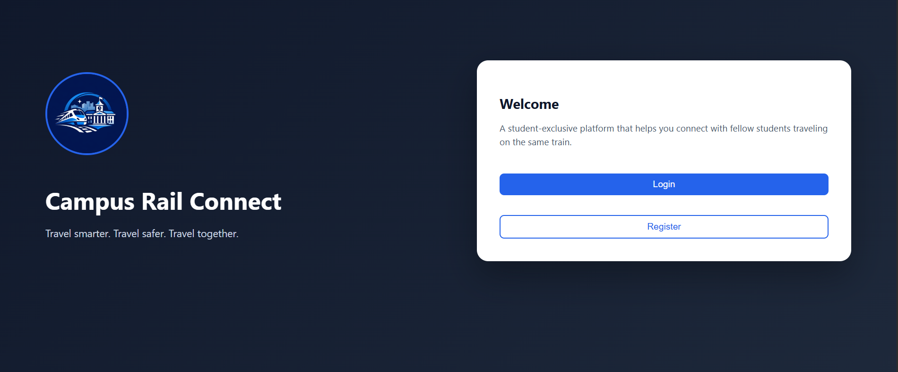
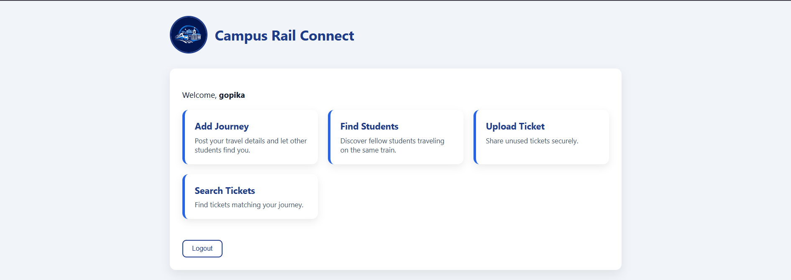
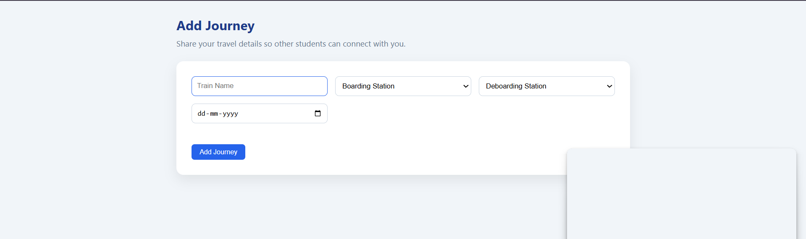
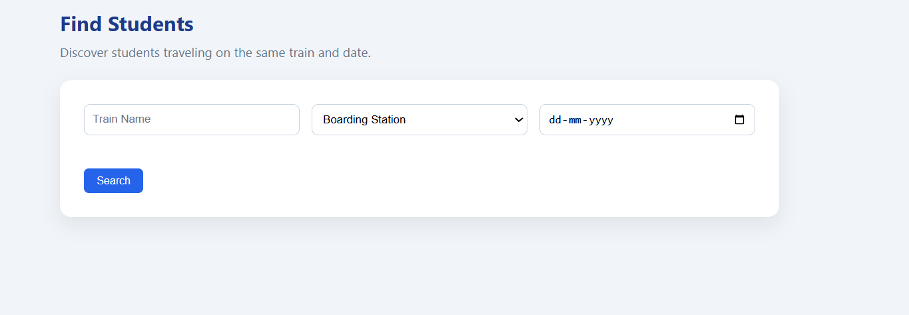
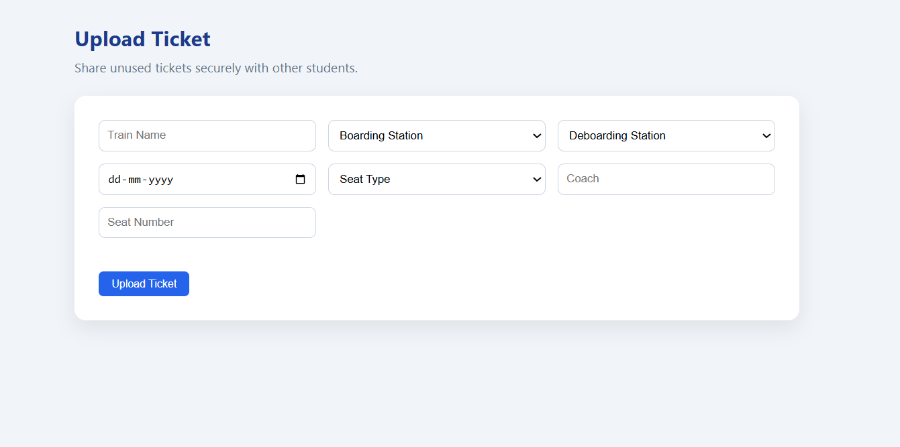
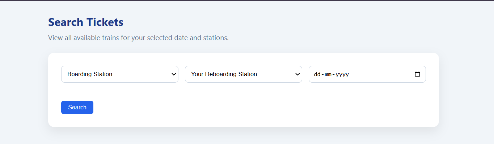

<p align="center">
  
</p>

# Campus Rail Connect 🎯

## Basic Details


### Team Member
 [Merin George] - [College of Engineering, Trivandrum]


### Hosted Project Link
[(https://tink-her-hack-campus-rail-connect.vercel.app/)]

### Project Description
Campus Rail Connect is a student-exclusive web platform that helps college students:
  Find fellow students traveling on the same train
  Share unused tickets responsibly
  Travel safer by coordinating journeys
It connects verified college students using their college email accounts.

### The Problem statement
Students often travel alone between cities, especially for college and holidays.
Problems include:
  Safety concerns while traveling alone
  Difficulty finding trusted co-passengers
  Unused train tickets going to waste
  No structured platform for student travel coordination

### The Solution
Campus Rail Connect provides:
  College email verified registration
  Journey matching based on train, date, and boarding station
  Ticket sharing system with seat type and availability
  Deboarding logic to ensure correct ticket transfer
  Dashboard to track personal journeys and uploaded tickets
It creates a safe, structured, and student-only travel network.

---

## Technical Details

### Technologies/Components Used

**For Software:**
- Languages used: JavaScript
- Frameworks used: React.js
- Libraries used: React Router, Firebase SDK
- Tools used: VS Code, Git & GitHub, Firebase Console

## Features

List the key features of your project:
- Feature 1: College Email Authentication
- Feature 2: Add Journey
- Feature 3: Find Students (same train, station & date)
- Feature 4: Upload Ticket (with seat type: SL, 3A, 2A, 1A, CC, 2S)
- Feature 5: Search Tickets (auto shows all valid trains for date)
- Feature 6: Deboarding station validation logic
- Feature 7: Dashboard showing: 1.Your Journeys, 2.Your Tickets, 3.Ticket Status (Available / Claimed)

---

## Implementation

### For Software:

#### Installation
```bash
[npm install]
```

#### Run
```bash
[npm start]
```

## Project Documentation

### For Software:

#### Screenshots (Add at least 3)

]
*Add caption explaining what this shows*

ot2](Dashboard)
*Add caption explaining what this shows*

t3](Add Journey)
*Share your travel details so other students can connect with you.*

nshot3](Find Students)
*Discover students traveling on the same train and date.*

ot3](Upload Tickets)
*Share unused tickets securely with other students.*

ot3]()
*View all available trains for your selected date and stations.*


#### Diagrams

**System Architecture:**


*SYSTEM ARCHITECTURE
Campus Rail Connect follows a Client–Cloud Architecture using React for the frontend and Firebase for backend services. The system is built as a serverless web application where authentication, database management, and hosting are handled entirely by Firebase.
Frontend Layer (Client Side)
  The frontend is developed using React.js.
Responsibilities:
  Rendering user interface (Home, Dashboard, Forms)
  Handling form inputs (Journeys and Tickets)
  Navigation using React Router
  Communicating with Firebase services
  Implementing business logic such as station order validation and filtering
  All filtering logic and validation (like station order checking) is handled on the client side. The frontend runs in the user’s browser.
Authentication Layer
  Authentication is handled using Firebase Authentication.
Purpose:
  Secure user registration and login
  College email-based verification
  Session management
  Unique User ID (UID) generation for each user
When a user registers:
  Firebase generates a unique UID.
  That UID is used to store user details in Firestore.
  The same UID links journeys and tickets to the correct user.
  This ensures secure identity management and proper data ownership.
Database Layer (Cloud Firestore)
  All application data is stored in Firebase Firestore, a cloud-based NoSQL database.
  The system uses three main collections:
    Users Collection:
    Stores:
      Username
      Email
      Phone number
    Each document is identified using the Firebase UID.

    Journeys Collection:
      Stores:
      Train name
      Boarding station
      Deboarding station
      Date
      User ID
    This collection is used in the “Find Students” feature.

    Tickets Collection:
      Stores:
        Train name
        Boarding station
        Deboarding station
        Date
        Seat type (SL, 3A, 2A, 1A, CC, 2S)
        Coach number
        Seat number
        Claimed status (true or false)
        User ID
      This collection powers the “Search Tickets” feature.

Data Flow

Registration Flow:
  User submits registration form → Firebase Authentication creates account → User details stored in Firestore under the generated UID.

Add Journey Flow:
  User submits journey form → Journey stored in the “journeys” collection with userId.

Find Students Flow:
  User enters train, boarding station, and date → Firestore is queried for matching journeys → Matching user IDs are retrieved → User details are fetched from the “users” collection → Names and phone numbers are displayed.

Upload Ticket Flow:
  User fills ticket form → Ticket is stored in the “tickets” collection → Ticket status is initially set to available (claimed = false).

Search Tickets Flow:
  User selects boarding station, deboarding station, and date → Tickets are fetched from Firestore → Frontend filters:
  Same date
  Same boarding station
  Not claimed
  Valid station order
  Matching tickets are displayed.
  If a ticket is claimed, its status is updated in Firestore.

Station Order Logic:
  The system maintains a predefined station sequence:
  TVC → VAK → QLN → KYJ → … → KGQ

  While searching tickets:
    The user’s deboarding station must appear before or equal to the ticket’s final station.
    This ensures valid travel routes.
    Prevents incorrect ticket transfers.
    This logic is implemented on the frontend.

Security Model
  Firebase Authentication ensures only registered users can access the system.
  Firestore security rules can restrict users to modify only their own journeys and tickets.
  Claimed tickets are hidden from search results.

Deployment Architecture
The application is deployed using:
Vercel
The React frontend connects securely to Firebase services over HTTPS.

Architecture Summary:
  The system follows:
    Serverless Architecture
    Cloud-based NoSQL Database
    UID-based data linking
    Client-side business logic

Modular React component design
  This architecture ensures scalability, security, and simplicity without requiring a traditional backend server.*

**Application Workflow:**


*Campus Rail Connect follows a structured workflow that guides users from registration to journey coordination and ticket sharing.
User Registration and Login
  Step 1: The user opens the website.
  Step 2: The user registers using their college email, username, password, and phone number.
  Step 3: Firebase Authentication creates a unique User ID (UID).
  Step 4: User details are stored in the Firestore “users” collection.
  Step 5: The user logs in and is redirected to the Dashboard.

Dashboard Workflow
After login, the user is taken to the Dashboard where they can:
  Add Journey
  Find Students
  Upload Ticket
  Search Tickets
  View their own journeys and tickets
  The Dashboard also displays:
    Previously added journeys
    Uploaded tickets
    Ticket status (Available or Claimed)

Add Journey Workflow
  Step 1: User selects:
                Train name
                Boarding station
                Deboarding station
                Date

  Step 2: The journey details are saved in the “journeys” collection in Firestore.

  Step 3: The journey is linked using the user’s UID.

  Step 4: Other students can now find this journey using the Find Students feature.

Find Students Workflow
  Step 1: User enters:
              Train name
              Boarding station
              Date

  Step 2: Firestore is queried for matching journeys.

  Step 3: Matching journeys are filtered based on:
              Same train
              Same boarding station
              Same date

  Step 4: User IDs from matching journeys are retrieved.

  Step 5: User details (name and phone number) are fetched from the “users” collection.

  Step 6: Matching students are displayed.

Upload Ticket Workflow
  Step 1: User fills ticket details:
              Train name
              Boarding station
              Deboarding station
              Date
              Seat type (SL, 3A, 2A, 1A, CC, 2S)
              Coach
              Seat number

  Step 2: Ticket is stored in the “tickets” collection.

  Step 3: Ticket is marked as Available (claimed = false).

  Step 4: The ticket becomes visible in Search Tickets.

Search Tickets Workflow
  Step 1: User selects:
              Boarding station
              Deboarding station
              Date

  Step 2: All tickets are fetched from Firestore.

  Step 3: Frontend filters tickets based on:
          Same date
          Same boarding station
          Not claimed
          Valid station order logic
          Station order logic ensures:
          The user’s deboarding station must come before or equal to the ticket’s final station.

  Step 4: Matching tickets are displayed along with:
              Train name
              Seat type
              Coach
              Seat number
              Owner name
              Phone number

  Step 5: If a ticket is claimed, its status is updated to claimed = true.

  Step 6: Claimed tickets are no longer shown in search results.

Ticket Claiming Workflow

  Step 1: User clicks “Mark Claimed”.

  Step 2: The ticket’s claimed field is updated in Firestore.

  Step 3: Ticket status changes to Claimed.

  Step 4: Dashboard reflects updated ticket status.*


## Project Demo

### Video
[Add your demo video link here - YouTube, Google Drive, etc.]

*Explain what the video demonstrates - key features, user flow, technical highlights*

### Additional Demos
[Add any extra demo materials/links - Live site, APK download, online demo, etc.]

---

## AI Tools Used (Optional - For Transparency Bonus)

If you used AI tools during development, document them here for transparency:

**Tool Used:** ChatGPT

**Purpose:** 
- Generated React component structures"
- Assisted with Firebase Authentication and Firestore integration
- Debugged runtime errors (undefined field values, filtering issues)
- Helped implement station order validation logic
- Suggested UI improvements and professional layout styling
- Assisted in writing README documentation and system architecture

**Key Prompts Used:**
- Assisted in writing README documentation and system architecture
- Fix undefined field value error in Firebase
- Implement station order logic for ticket filtering
- Improve dashboard UI with professional card layout
- Write system architecture explanation and application workflow documentation for README

**Percentage of AI-generated code:** [Approximately 40%]

**Human Contributions:**
- Architecture design and planning
- Custom business logic implementation
- Integration and testing
- UI/UX design decisions
- Testing, debugging, and final feature validation

*Note: Proper documentation of AI usage demonstrates transparency and earns bonus points in evaluation!*

---


Made with ❤️ at TinkerHub
>>>>>>> 4ebaf364f73660b07cb2a00c7aedb3043b55fa77
